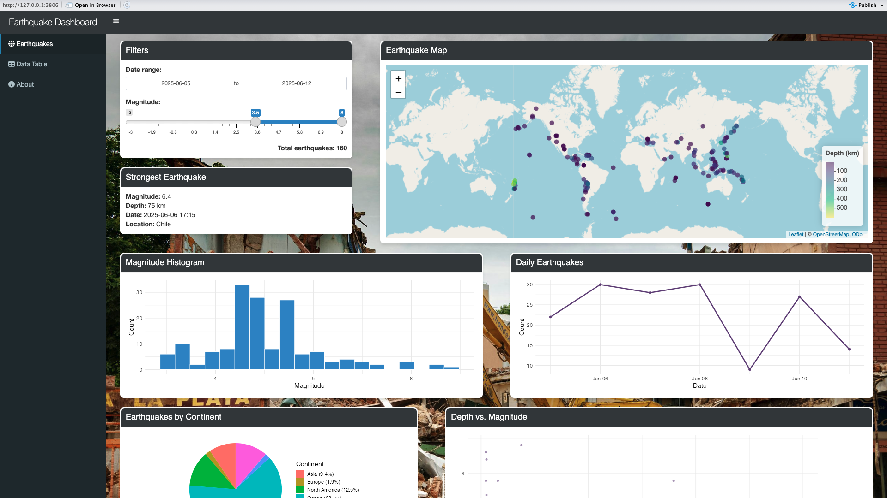

# Earthquake Dashboard

Interactive dashboard built with **R Shiny** for exploring and analyzing recent earthquake data.

## Preview

## Overview
This application provides an interactive interface for analyzing earthquake data using maps, charts, and tables.

Users can **filter earthquakes by date and magnitude**, explore geographic patterns, and analyze relationships between variables such as depth and magnitude.

## Features
- Interactive map of earthquakes (Leaflet)
- Filtering by date range and magnitude
- Magnitude distribution histogram
- Daily earthquake trends
- Earthquakes by continent
- Top countries with the highest number of earthquakes
- Depth vs magnitude analysis
- Interactive data table
  
## Dataset
Earthquake data sourced from the **USGS Earthquake Catalog**.

## Technologies Used
- R  
- Shiny / shinydashboard
- leaflet
- ggplot2
- dplyr
- sf
- rnaturalearth
